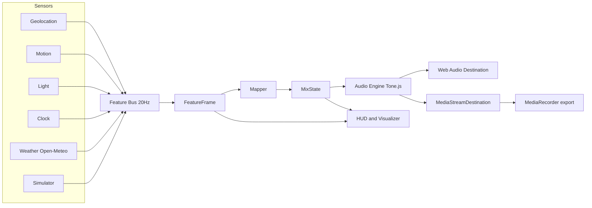

# RoadOST

RoadOST is a browser app that turns your drive into a live rock and cinematic score by mixing synthesized layers in real time.

RoadOST is not a live Suno or MusicGen song generator. It does not stream full songs from a model. It uses a game-audio style stem mixer driven by sensor features.

Live demo: [https://aditano.github.io/RoadOST/](https://aditano.github.io/RoadOST/)

## Stack

- Vite 6
- TypeScript (strict)
- Vanilla TypeScript UI
- Tone.js on Web Audio API
- Vitest

## Run locally

```bash
npm install
npm run dev
```

Build and test:

```bash
npm test
npm run build
```

## Sensor permissions and platform notes

- `Start score` is a user gesture and is required before Web Audio starts.
- iOS Safari requires motion permission for `DeviceMotionEvent`. The app requests this on start.
- Geolocation requires HTTPS on mobile browsers. On localhost it works in modern browsers.
- If live geolocation is unavailable, the app switches to Simulator mode for demo continuity.
- Ambient light sensor is only available in some Chromium environments. If missing, the app estimates lux from hour and cloud cover while still marking light as missing.

## What it does

- Fuses speed, acceleration, heading, light, local hour, and weather into a `FeatureFrame` at about 20 Hz.
- Maps features to `MixState` (`bpm`, `energy`, `density`, `brightness`, `crunch`, `rain`, `tunnel`, `palette`).
- Drives six synthesized layers: drums, bass, crunch guitar, pad, lead, and weather bed.
- Includes a first-class Simulator with presets and a 90 second timeline scrub/playback.
- Supports recording through `MediaRecorder` from a captured audio destination.

## Architecture



## Taste and mapping table

| Input signal | Mapping effect |
| --- | --- |
| Speed (m/s) | BPM from 92 to 164 via smoothstep, speed-heavy energy contribution |
| Acceleration RMS | Adds aggression to energy and crunch |
| Rain and weather code | Raises rain layer and texture hats, darkens brightness |
| Hour and isNight | Selects palette (`dawn`, `day`, `dusk`, `night`) and brightness baseline |
| Lux drop | Tunnel spike to 1.0 with 8 second decay |
| Energy | Controls density and lead entry threshold |

Palette keys:

- Dawn: A minor
- Day: E minor
- Dusk: F# minor
- Night: D minor

## Simulator presets

- Night rain highway
- Sunny neighborhood
- Dawn commute
- Tunnel blast
- Storm crawl

These presets are intentionally different in speed, rain, light, and hour so the resulting mix is audibly different in bpm, density, brightness, and wet texture.

## Safety behavior

- While driving is active (`speed > 4 m/s`), settings and simulator controls are hidden and non-interactive.
- Stop remains available as the only intentional driving action.

## License

MIT. See [`LICENSE`](./LICENSE).
