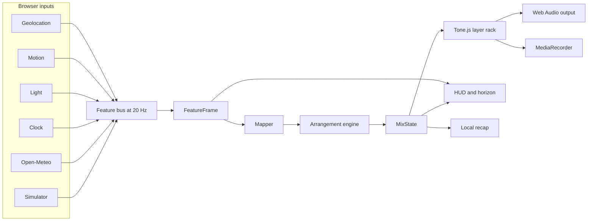

# RoadOST

RoadOST is a website. [Open the live demo](https://aditano.github.io/RoadOST/) in a browser and start driving. There is no native app to install, no account, and no API key.

It turns speed, motion, heading, light, time, and weather into a live classic rock and cinematic score. Pair a phone to the car over Bluetooth, tap **Start score**, and the synthesized arrangement responds to the road.

RoadOST is not a live song generator. It does not call Suno, MusicGen, or another hosted model. It uses a low-latency game-audio style stem mixer built with Tone.js.

## Landing page and drive studio

The default URL opens a product landing page:

- [https://aditano.github.io/RoadOST/](https://aditano.github.io/RoadOST/)

The drive studio is one click away, or it can be opened directly:

- [https://aditano.github.io/RoadOST/?view=studio](https://aditano.github.io/RoadOST/?view=studio)
- [90 second simulator demo](https://aditano.github.io/RoadOST/?view=studio&sim=1&preset=night-rain-highway&demo=1)

The studio includes Live and Simulator modes, a road-horizon visualizer, sensor HUD, ten simulator presets, a 90 second timeline, audio export, recap, and compact share links.

## Mapping and arrangement

| Road signal | Musical response |
| --- | --- |
| Speed | BPM from 92 to 164, plus most of the energy signal |
| Acceleration RMS | Adds energy, crunch, and attack |
| Heading rate | Adds small fill bias and stereo movement |
| Rain and weather code | Adds hats and weather texture, reduces lead clutter, darkens tone |
| Wind | Opens a filtered wind bed |
| Local hour | Selects the key center: dawn A minor, day E minor, dusk F# minor, night D minor |
| Sunset heat | Adds the optional `gold` palette overlay |
| Storm, snow, or heavy rain | Adds the optional `storm` palette overlay |
| Fast lux drop | Forces a two-bar tunnel break and opens the filtered pad |
| Energy under 0.28 | Holds a verse or break |
| Energy 0.28 to 0.55 | Selects verse |
| Energy 0.55 to 0.75 | Selects lift |
| Energy over 0.75 | Selects chorus and enables the sub-bass voice |
| Two-bar energy swing over 0.18 at an eight-bar boundary | Fires a one-bar tom and crash fill |

Every session begins with an eight-bar intro. Sections normally hold for at least four bars. Tunnel spikes are the exception and force a two-bar break. Highways or choruses add sub bass, chorus entries add a filtered riser, thunderstorms add a rare thunder tick, and rain over 0.45 thickens the hats and weather bed.

## URL flags

| Flag | Effect |
| --- | --- |
| `?view=studio` | Skip the landing page |
| `#studio` | Also opens the studio |
| `?sim=1` | Open the studio in Simulator mode |
| `?preset=night-rain-highway` | Restore a simulator preset |
| `?demo=1` | Start the 90 second timeline after the first Start tap |

Share links contain only the view, mode, and preset. They do not contain a drive trace or recap data.

## Simulator presets

- Night rain highway
- Sunny neighborhood
- Dawn commute
- Tunnel blast
- Storm crawl
- Midnight city
- Mountain descent
- Heatwave
- Blizzard
- Late ferry

The presets differ in speed, acceleration, light, weather, wind, visibility, palette overlay, tempo, brightness, and section tendency.

## Recap, storage, and export

Stopping or saving a drive creates a recap with duration, average and peak speed, peak energy, dominant palette, rain fraction, and section timeline. The latest ten recaps are kept locally under `roadost.recaps.v1` in `localStorage`.

**Save this drive** records the browser audio graph with `MediaRecorder` and downloads a WebM audio file when supported. Settings for volume, held key, reduced motion, and last view also stay in local browser storage.

## Run locally

Requirements: Node.js 20 or newer and npm.

```bash
npm install
npm run dev
```

Vite serves the project at `http://localhost:5173/RoadOST/` because the production Pages base remains `/RoadOST/`.

Verify a change with:

```bash
npm test
npm run build
```

## Sensor notes

- Browser audio starts only after a user tap.
- Geolocation requires HTTPS outside localhost. Speed comes from `coords.speed` when available, or distance over time as a fallback.
- iOS Safari requires a user gesture before requesting `DeviceMotionEvent` permission.
- Ambient Light Sensor support is limited, mostly to some Chromium environments. When it is missing, RoadOST estimates light from time and cloud cover while labeling the light source as missing.
- Open-Meteo provides temperature, weather code, precipitation, cloud cover, day state, wind, and optional visibility without an API key. Weather failures are soft.
- If live geolocation remains unavailable, the studio switches to Simulator mode and says so.
- Sensor availability differs by phone, browser, permissions, and mounting position. The HUD labels every signal as live, simulated, or missing.
- While a live drive is running above 4 m/s, interactive chrome is hidden and the giant Stop control remains.

## Architecture



The production build is a static Vite site deployed by GitHub Actions to GitHub Pages. There is no backend, analytics, account system, or live music-generation service.

## Keyboard controls

- `Space`: start or stop when focus is not in a control
- `1` through `9`: select the first nine simulator presets
- `L`: Live mode
- `S`: Simulator mode
- `Esc`: return to the landing page

## License

MIT. See [LICENSE](./LICENSE).
